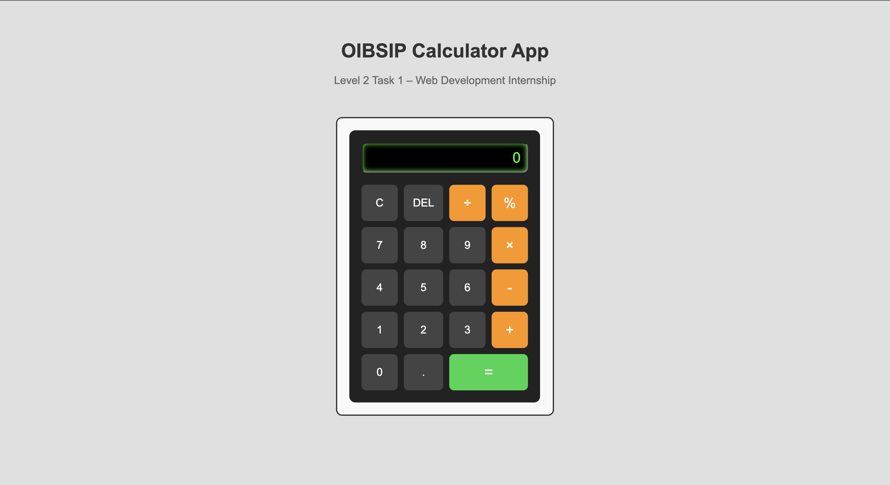
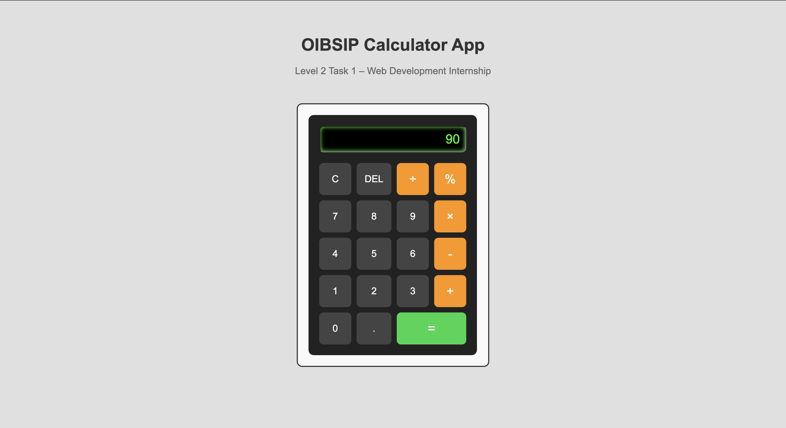
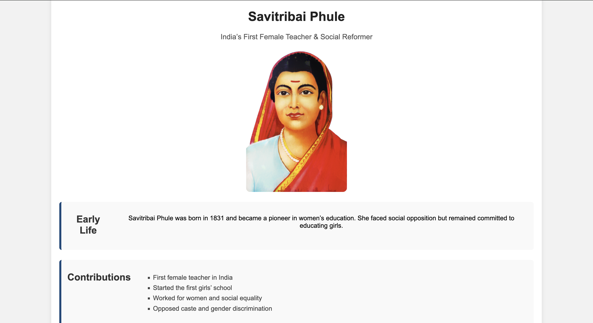
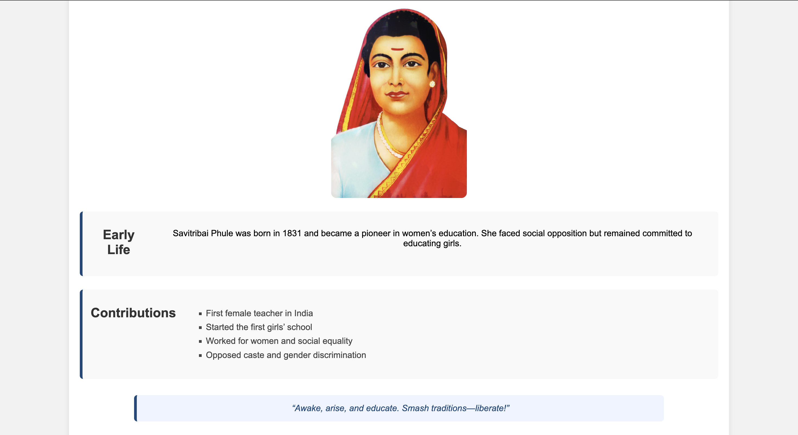

# OIBSIP – Web Development Internship Projects

This repository contains the tasks completed as part of the **Oasis Infobyte Web Development and Designing Internship**.

---

## 🔢 Level 2 – Task 1: Calculator Application

A fully functional calculator web application built using **HTML, CSS, and JavaScript**.

### ✨ Features
- Basic arithmetic operations: Addition, Subtraction, Multiplication, Division
- Percentage calculation
- Clear (C) and Delete (DEL) functionality
- Real-time display updates
- Clean and responsive UI using CSS Grid
- User-friendly button interactions

### 🛠️ Tech Stack
- HTML5
- CSS3 (Grid Layout)
- JavaScript (DOM Manipulation, Event Handling)

### 📂 Project Structure

Calculator/
├── index.html
├── style.css
└── script.js

## Screenshots

## 🌸 Level 2 – Task 2: Tribute Page – Savitribai Phule**OIBSIP 

## 📌 Project Overview
This project is a **Tribute Page** dedicated to **Savitribai Phule**, one of India’s greatest social reformers and the first female teacher of India.  
The page highlights her life, achievements, and contribution towards women’s education and social equality.

This project was developed as part of the Oasis Infobyte Web Development Internship (Level 2 – Task 2).
---

## 🛠️ Technologies Used
- **HTML5** – Structure of the webpage  
- **CSS3** – Styling and layout  
- **Google Fonts** – For better typography  

---

## ✨ Features
- Clean and simple UI design  
- Informative content about Savitribai Phule  
- Responsive layout for better viewing  
- Well-structured sections (Intro, Timeline, Achievements)  

---

## 📂 Project Structure

Task-2-Tribute-Page/
├── index.html
├── style.css

## 🖼️ Screenshots

### 🔹 Desktop View

# Level 2 Task 3: To-Do App

A simple and responsive **To-Do Web Application** built using **HTML, CSS, and JavaScript** as part of the **Oasis Infobyte Web Development Internship**.

## Features
- Add tasks to Pending list
- Mark tasks as Completed
- Delete tasks
- Data persistence using localStorage
- Responsive design for desktop and mobile

## Tech Stack
- HTML5  
- CSS3  
- JavaScript

## Project Structure
Task-3-ToDo-App/
├── index.html
├── style.css
├── script.js
└── images/

## Screenshots
- ![Desktop View] (./Task-3-ToDo-App/screenshots/todo-desktop.png)
- ![Mobile View] (screnshots/todo-mobile.png)

---
